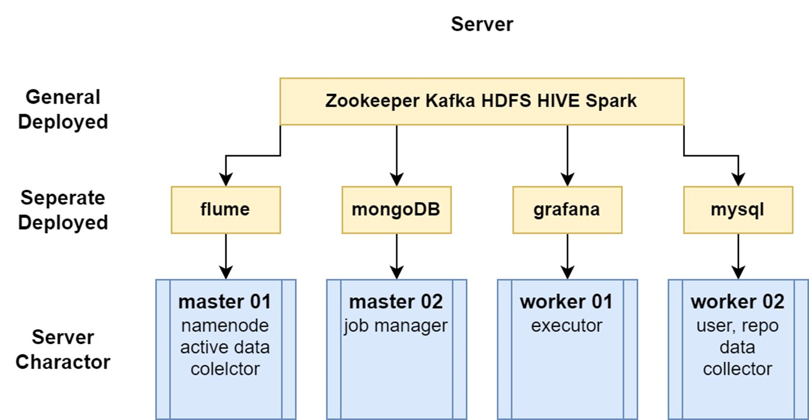

# msbd5003-project

## Repo Structure

- ***/api:***  store API test result about Github, bilibli
    - Just import file in “./postman” to ***Postman*** to try API
- ***/cluster***: contains ***automatic configure script*** and ***configuration file of all components of system***
    - ***/configs***: main directory, contains the above files
    - ***/backup-config*** and ***/test*** are some useless directory
- ***/data_gen***: python script to collect raw data
    - ***/time_spider:***	`timer_spider.py` is the main script, it will download GH archive compressed package and call Github Open API to collect data.  API data of users and repos will be stored in MySQL and merge with GH Archive data. After merging, the data will write to a json file, which is watched by **flume**
- ***/data_preprocess***: process raw data of **HDFS** and extract activity table into **Hive**
    - ***/load2hive***: shell will call python script to load raw data file in **HDFS** to **Hive** base table
    - ***/hive2event***: shell will call python script to extract **Hive** base table to different activity table
    - ***/mysql2hive***: shell will call python script to load user and repo data in **MySQL** to **Hive**
- ***/data_analysis:*** analyze data in **Hive** and store result to **Hive**, **MySQL**, ***MongoDB***
    - ***/sql:*** contains schema of **MySQL**
    - `analysis.sh` will call python script to execute multiple tasks in a loop, **spark** will do data aggregation of **Hive**
- ***/data_vis***: **ARCHIVED**, contains config of **superset**, a data visualization component of big data, but we use **grafana** to replace it, and **Grafana** only need to install package and be configured by graphic interaction.
- ***/real_data_process***: only contains one python script which is used to run spark streaming to capture data from **Kafka**
    - need to set `config` for `Sparksession`, or it will use all resources to run and block out other ***Spark*** tasks
- ***/mysql_data_bk:*** contains some data collected by Github Open API, you just need to create corresponding schema and import these two sql file to **MySQL**

## Data Source

### Github Archive

- Download `json.gz` from Github Archive according to timestamp, we download latest non-existing data each time
- Filter the useless `url` property in json file
- We regard this part as **offline** data, but in fact it’s almost real-time:
    - we download one hour by one hour, and imitate it as a continuous data flow
    - the data is updated by GH Archive Servers, though there are few hours’ latency,

### Github Open API

- We call Github’s Open API to query what we are interested in
    - Github Archive only contains the basic information of ***activity***
- This will need to get a valid token from github account, then you can call API 5000 times per hour
    - You can test API by Postman

## Architecture

    Whole Framework

    Cluster and component structure

    Data Schema

    Auto Config Control Flow

## Configuration

***You can check ./cluster/configs directory to get details of configuration of each components*** 

### Spark

Some basic configurations of Spark are as follows:

- `MASTER=spark://master01:7077` 
- `SPARK_MASTER_WEBUI_PORT=8090` : to avoid port conflict
- `SPARK_HISTORY_OPTS=-Dspark.history.fs.logDirectory=hdfs://master01:8020/user/hadoop/evtlogs`: the history log directory is set to HDFS: `/user/hadoop/evtlogs`

### Hive

There are two ways to configure Hive with Spark: `Spark on Hive` and `Hive on Spark`. The former is to use Hive as a metastore, and the latter is to use Hive as a SQL engine. In this project, we use the former way. Reasons are as followd:

- `Hive on Spark` need to recompile Spark and import `jar` packages, which is not convenient for us to use.
- Our main program will use pyspark, which is not compatible with Hive on Spark.
- More and more companies use SparkSQL to construct their data warehouse, and Hive is just a metastore.

### Port

| Port | Service | Description |
| ---- | ------- | ----------- |
| 8088 | YARN | YARN ResourceManager |
| 9870 | HDFS | HDFS NameNode |
| 9868 | HDFS | HDFS SecondaryNameNode |
| 9864 | HDFS | HDFS DataNode |
| 8042 | YARN | YARN NodeManager |
| 8090 | Spark | Spark Master WebUI |
| 8091 | Spark | Spark Worker WebUI |
| 18080 | Spark | Spark History Server |
| 9083 | Hive | Hive Metastore |
| 10000 | Hive | HiveServer2 |
| 3306 | MySQL | MySQL Server |
| 8020 | HDFS | |
| 37017 | MongoDB | MongoDB Server |
| 3000 | Grafana | Grafana Server |
| 12222 | SSH | SSH Port |
| 2888 | Zookeeper | Zookeeper Server |
| 3888 | Zookeeper | |
| 9092 | Kafka | Kafka Server |
| 2181 | Kafka | zookeeper and kafka |
| 7890 | Clash | VPN Server |
| 7891 | Clash | VPN Server |

## Start Step

### Cluster Config and Start

All corresponding files and directories are located at `cluster/configs`

- local PC:

    - modify `hosts` file with LF line ending, need to add one empty line at the end of the file

    - copy `configs` directory to `$HOME` at master01

- Servers:

    - modify privilege of private key `ali-5003.pem` to `600` , so can be used by `ssh`

    - add execution priviledge to all shell scripts in `configs/tools` directory

    - run `sudo ./0-remoteConfig.sh` to config all nodes
      - The most part of this shell aims to config ssh-no-password-login with ensure the security
      - Aliyun servers are frequently attacked, so we need to do this.
      - Sometimes the execution of shell scripts will be terminated with no reason, and cannot finish the whole installation, need to check log to ensure installation finish
      - This will need about `5-10` minutes

    - run `sudo ./1-remoteStart.sh` to start all nodes

#### Attention

- After running `0-remoteConfig.sh`, the ssh port will be modified to `12222`
  - Aliyun server will be attacked very often, and the `22` port is the most dangerous port
  - You need to add parameter to set `ssh` login instruction with `ssh user@ip -p 12222`
  
- Logs of initialization and starting are located at `cluster/configs/logs`, shell script won't producce too much info, so details can be found in logs.

### Data Pipeline

1. Run `time_spider.py` to provide a stable data source for **flume**
    1. **Flume** and **Kafka** will import data from local json to **HDFS** automatically
2. Use scripts to run ***data_preprocess*** in the background
    1. ***Use `nphup ... >> execute.log &`*** to ensure timer shell scripts won’t be interrupt by ssh disconnection
3. Use scripts to run ***data_analysis*** in the background
4. Use script to run ***real_time_process*** in the frontground
5. Data Visualization need to create dashboard, create graph by writing SQL in the WebUI